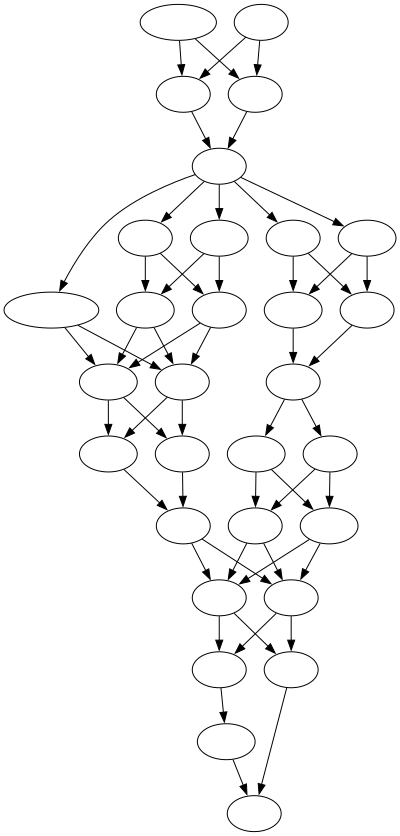

# Tabito (library)

Suppose you are making an app to help Japanese language learners, and you want users to learn a sentence like,
> <ruby>京<rt>きょう</rt></ruby><ruby>都<rt>と</rt></ruby>でたくさん<ruby>写<rt>しゃ</rt></ruby><ruby>真<rt>しん</rt></ruby>を<ruby>撮<rt>と</rt></ruby>りました

Specifically, suppose you want to show them the English translation, something like *"In Kyoto, (I) took a lot of photos"*, and you want them to type in the above sentence, or something like it.

- "たくさん" ("lots") can function as an adverb so you want to allow: <ruby>京<rt>きょう</rt></ruby><ruby>都<rt>と</rt></ruby>で<ruby>写<rt>しゃ</rt></ruby><ruby>真<rt>しん</rt></ruby>をたくさん<ruby>撮<rt>と</rt></ruby>りました
- Of course you want to allow the informal conjugation of <ruby>撮<rt>と</rt></ruby>りました, so: <ruby>撮<rt>と</rt></ruby>った
- Oh, sometimes IME will convert たくさん to kanji: <ruby>沢<rt>たく</rt></ruby><ruby>山<rt>さん</rt></ruby>
- And in fact you want to allow any combination of kanji and kana.
- By the way, you'll want to treat hiragana and katakana as equivalent (again, IME).

In summary, your simple sentence is actually this directed acyclic graph (DAG):



Tabito (<ruby>旅<rt>ta</rt></ruby><ruby>人<rt>bito</rt></ruby>, "travel person") is a dependency-free public-domain JavaScript/TypeScript library that helps with this. It exports a few functions which are used to
1. construct the graph above from a simpler editor-friendly representation (`sentenceToGraph`, see below),
2. break up user input into walks along that graph (`chunkInput`, see below), and finally,
3. a small utility that makes it easy to add "synonyms" (per this library's data model) given an equivalent sentence (`addSynonym`, see below).

## API

### `Sentence`
Before we start, this is the shape of the data to represent your sentence (from [`interfaces.ts`](./interfaces.js)):
```ts
type Furigana = string | { ruby: string; rt: string };

interface Sentence {
  furigana: Furigana[];

  // tuple's first element must be in `furigana` (string or `ruby`) along element boundaries.
  // Entries of the 2nd (array) may be empty string
  synonyms?: [string, Furigana[]][];
}
```
The `furigana` array represents the raw text of the sentence, with optional readings (using the `<ruby>` and `<rt>` HTML tags for [Ruby characters](https://developer.mozilla.org/en-US/docs/Web/HTML/Element/ruby), which are easy to hand-write as well as obtain from dictionaries like [JmdictFurigana](https://github.com/Doublevil/JmdictFurigana); however it is expected that this array represents morphemes coming out of an NLP (natural language processing) system like MeCab or Kuromoji or Ichiran).

The `synonyms` array lets you encode all the different grammatical variability discussed above—
- "たくさん" → <ruby>沢<rt>たく</rt></ruby><ruby>山<rt>さん</rt></ruby>
  - (of course we could have avoided needing this synonym by making the original sentence have the kanji and providing the furigana reading for it, but this just demonstrates the point)
- "撮りました" → <ruby>撮<rt>と</rt></ruby>った
- "たくさん写真を" → <ruby>写<rt>しゃ</rt></ruby><ruby>真<rt>しん</rt></ruby>をたくさん

Therefore, each element of the `synonyms` array must be a 2-tuple:
1. the string must be found inside top-level sentence's `furigana` (considering raw strings or `ruby` strings) along element boundaries. In more words,
   1. `mySentence.furigana.map(f => typeof f === 'string' ? f : f.ruby).join('').includes(synonym)` *must* be true, and
   2. more specifically, the synonym text *must* start and end on the boundaries of the top-level sentence's `furigana` array.
2. The second element of each synonym tuple is another array of furigana (strings or `ruby`/`rt` objects).

In [`demo.ts`](./demo.ts) you can see the exact form of this:
```js
  synonyms: [
    [
      "たくさん",
      [
        { ruby: "沢", rt: "たく" },
        { ruby: "山", rt: "さん" },
      ],
    ],
    ["撮りました", [{ ruby: "撮", rt: "と" }, "っ", "た"]],
    [
      "たくさん写真を",
      [
        { ruby: "写", rt: "しゃ" },
        { ruby: "真", rt: "しん" },
        "を",
        "たくさん",
      ],
    ],
  ],
```

### `function sentenceToGraph(sentence: Sentence): Graph`
Given an object in the shape of `Sentence` above, `sentenceToGraph` simply converts it to a graph object. This graph object is a plain old JavaScript object (POJO) but its exact contents are an implementation detail so they may change in future version.

### `function chunkInput(input: string, graph: Graph): Chunk[]`
Finally, this function takes
1. a string (raw input from a user) and
2. a graph object (output by `sentenceToGraph`)

and outputs its best guess at what nodes of the graph the text represents. It performs hiragana/katakana normalization, considers all synonyms, and looks at both kanji and furigana (the `rt` field) to find the longest walks through the graph present in the input.

The returned array has elements shaped like this:
```ts
export interface Chunk {
  text: string;
  status: "unknown" | "ok";
  start: boolean;
  full: boolean;
}
``` 
and each `Chunk` is guaranteed to contain consecutive substrings of the original input—that is, `chunks.map(c => c.text).join('') === input` is guaranteed to be true.

Therefore, the `status` field of each `Chunk` tells you whether this chunk's text is *somewhere* in the graph (`ok`) or not (`unknown`).

A given chunk's `text` will be the longest walk in the graph that can possibly be constructed. As two useful bonuses:
- the `start` flag indicates whether this `Chunk` started at the ancestor node of the graph, while
- the `full` flag indicates whether this chunk represents input which walks the graph from an ancestor node to a leaf node, i.e., if it's a *full* sentence—quiz apps may use this to know when the student has finished typing.

Consider the following examples to illustrate the above points:
```ts
console.log(chunkInput("京都で撮った", graph));
/*
[
  { text: '京都で', status: 'ok', start: true },
  { text: '撮った', status: 'ok', start: false }
]
*/

console.log(chunkInput("撮った、京都で", graph));
/*
[
  { text: '撮った', status: 'ok', start: false },
  { text: '、', status: 'unknown', start: false },
  { text: '京都で', status: 'ok', start: true }
]
*/

console.log(chunkInput("京都でしゃしん撮った", graph));
/*
[
  { text: '京都でしゃしん', status: 'ok', start: true },
  { text: '撮った', status: 'ok', start: false }
]
*/
```

### `function addSynonym(original: Sentence, syn: Furigana[]): Sentence`
It can be error-prone to hand-construct an entry for the `synonyms` array described above under [`Sentence`](#sentence), and it can be much more ergonomic for a user to simply type an entire sentence and have the library figure out the entry in `synonyms`. This function does this.

Given an existing `Sentence` object (with its array of `Furigana`, i.e., strings or `ruby`/`rt` pairs) and a synonymous sentence also broken up into an array of `Furigana`, this function carefully chips away at the start and endings of both original and synonymous sentence till it finds the bit that's differnt, and then appends a new entry to the input `Sentence` object.

This function is pure, i.e., it doesn't modify the original input `Sentence` but returns a copy (though, if it didn't find any differences or if the difference was already in the `synonyms` array, it'll return the original input).

## Install and usage
`npm install tabito-lib`

### ESM (i.e., EcmaScript modules, for TypeScript, Node.js, and browser `import`s)
`import { sentenceToGraph, chunkInput } from "tabito-lib";`

### CommonJS (Node `require`)
`const { sentenceToGraph, chunkInput } = require("tabito-lib");`

### IIFE (`<script>` tag in browsers)
Grab [`tabito.min.js`](./dist/tabito.min.js) and [`tabito.min.js.map`](./dist/tabito.min.js.map), put them somewhere your HTML can see, then the usual `<script src="path/to/tabito.min.js">`. Other scripts in your page can find the exported functions under `tabito`.

## Dev
To develop this repo, make sure you have [Git](https://git-scm.com) and [Node.js](https://nodejs.org/en) (any recent version). Then, in the command line (Terminal app in macOS, Command Prompt in Windows, xterm in Linux, etc.),
1. check out this repo: `git clone https://github.com/fasiha/tabito-lib`
2. enter the directory: `cd tabito-lib`
3. install a few dev dependencies: `npx pnpm install` (npx comes with Node.js)
   1. Of course plain `npm` will also work: `npm install`
4. run tests: `npm t` (npm comes with Node.js too, this runs the `script` named `"test"` in [`package.json`](./package.json))
5. run the demo: `npm run demo` (if you have Graphviz installed, (via Homebrew, Conda, etc.), i.e., if you have the `dot` command available, this will make a couple of pretty images)

## Changelog

### 1.1

Remove the `english` and `citation` fields in our `Sentence` type since they're out-of-scope. Recommended! But out of scope of this library.

### 1.0.7

Basic working library.